# Prueba Técnica — API  (.NET 8, ASP.NET Core, EF Core SQLite)

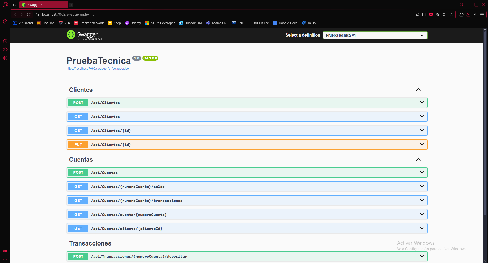

## Descripción
API REST para la gestión de clientes, cuentas bancarias y transacciones.  
Desarrollada como parte de una prueba técnica utilizando **.NET 8**, **ASP.NET Core**, **Entity Framework Core** y **SQLite**.

---

## Requisitos
- [SDK .NET 8](https://dotnet.microsoft.com/en-us/download/dotnet/8.0)
- SQLite (incluido con .NET, no requiere instalación adicional)
- (Opcional) [DB Browser for SQLite](https://sqlitebrowser.org/) para explorar la base de datos.

---

## Configuración de la conexión
En `appsettings.json`:
```json
{
  "Logging": {
    "LogLevel": {
      "Default": "Information",
      "Microsoft.AspNetCore": "Warning"
    }
  },
"AllowedHosts": "*",
  
  "ConnectionStrings": {
    "ConexionSQLite": "Data Source=DataBase.db"
  }
}
```
---

## Creación de la base de datos
Ejecutar en la carpeta de la solucion 

dotnet tool install --global dotnet-ef
dotnet ef migrations add Inicial
dotnet ef database update


## Ejecucion del proyecto 
dotnet run --project PruebaTecnica

## Abrir Swagger UI

https://localhost:5001/swagger

## Endpoints Principales 

### Clientes


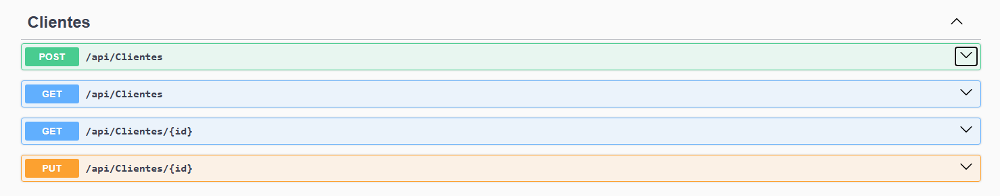

POST /api/clientes → Crear cliente
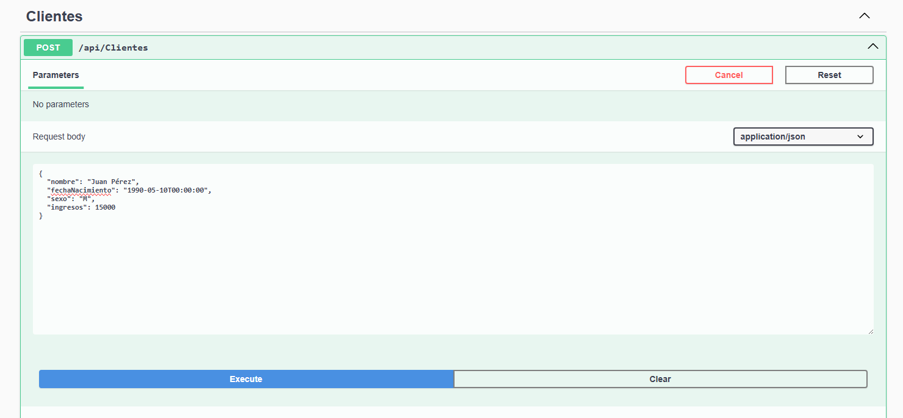

Respuesta

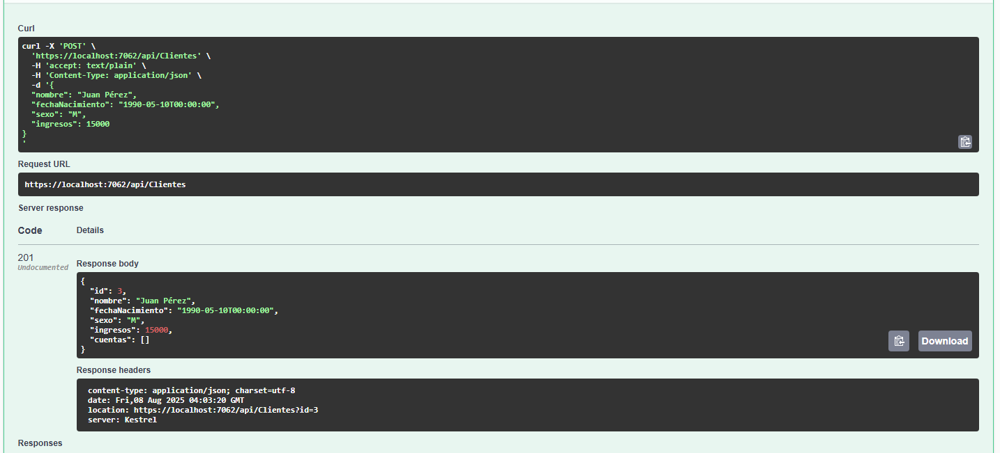

GET /api/clientes → Listar todos los clientes


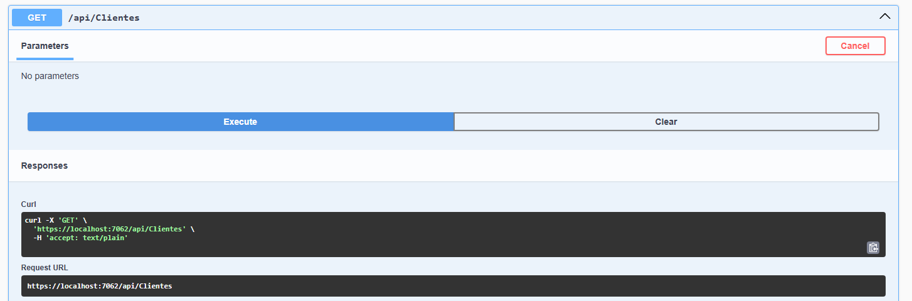

Respuesta

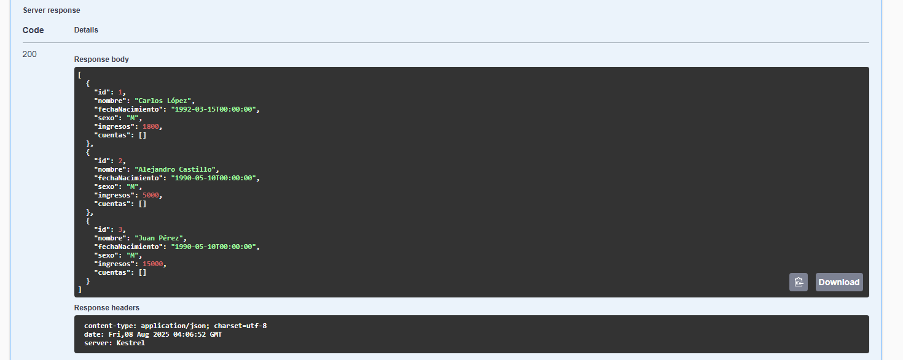


GET /api/clientes/{id} → Obtener cliente por ID

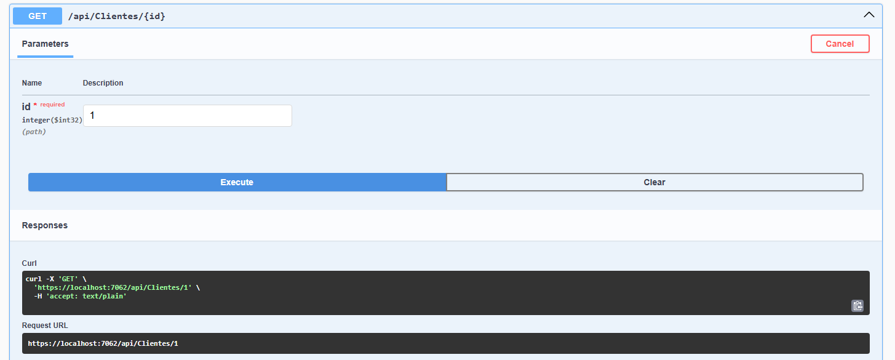

Respuesta

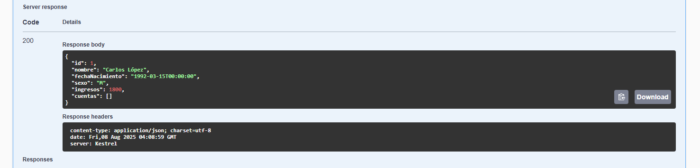


PUT /api/clientes/{id} → Actualizar cliente (requiere todos los campos)

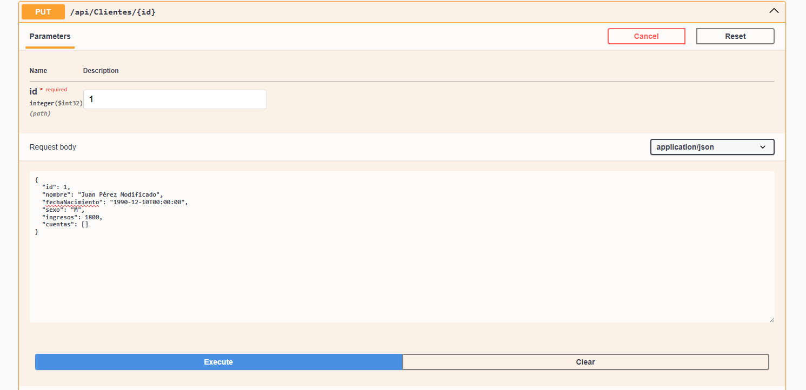

Respuesta

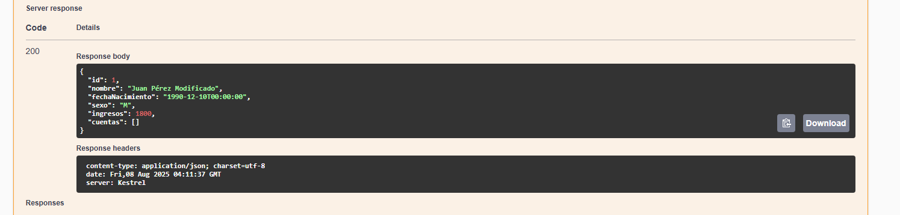

### Cuentas

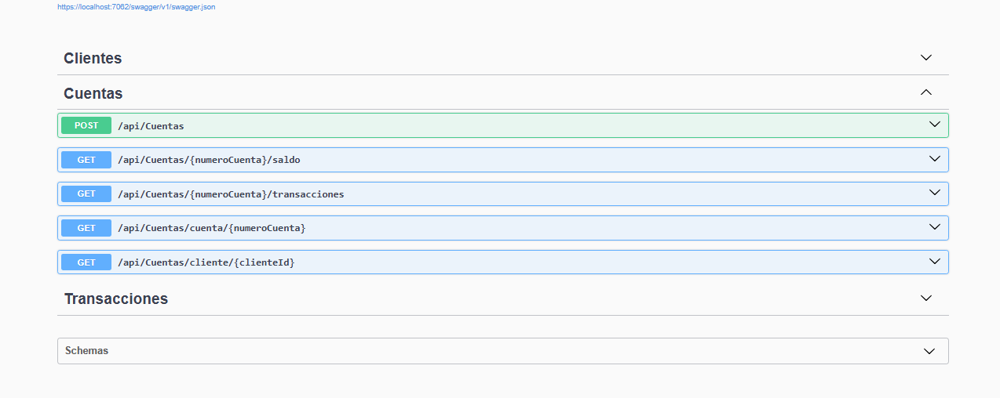


POST /api/cuentas/{clienteId}?saldoInicial=1000 → Crear cuenta bancaria


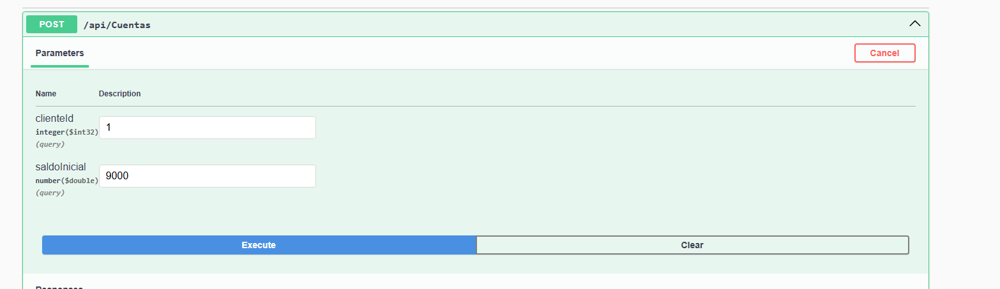

Respuesta


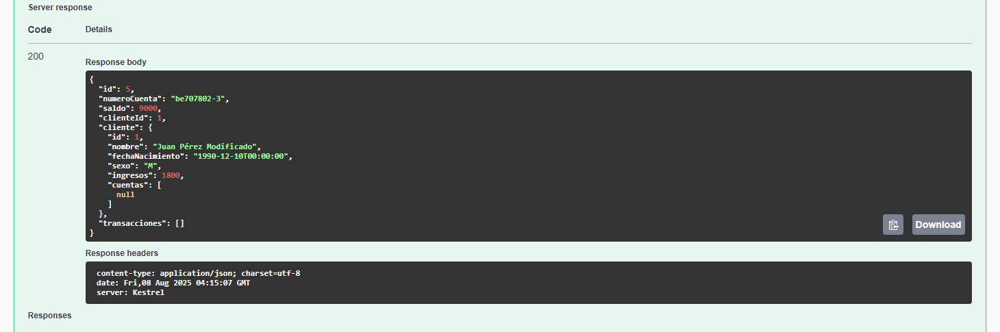

GET /api/cuentas/{numeroCuenta}/saldo → Consultar saldo


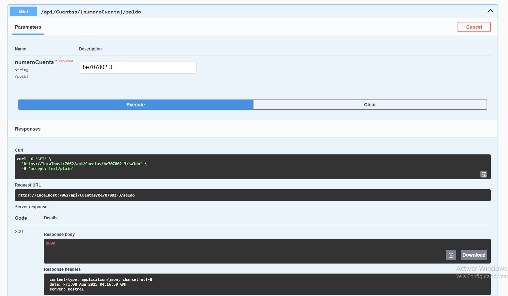


GET /api/cuentas/cuenta/{numeroCuenta} → Obtener cuenta por número


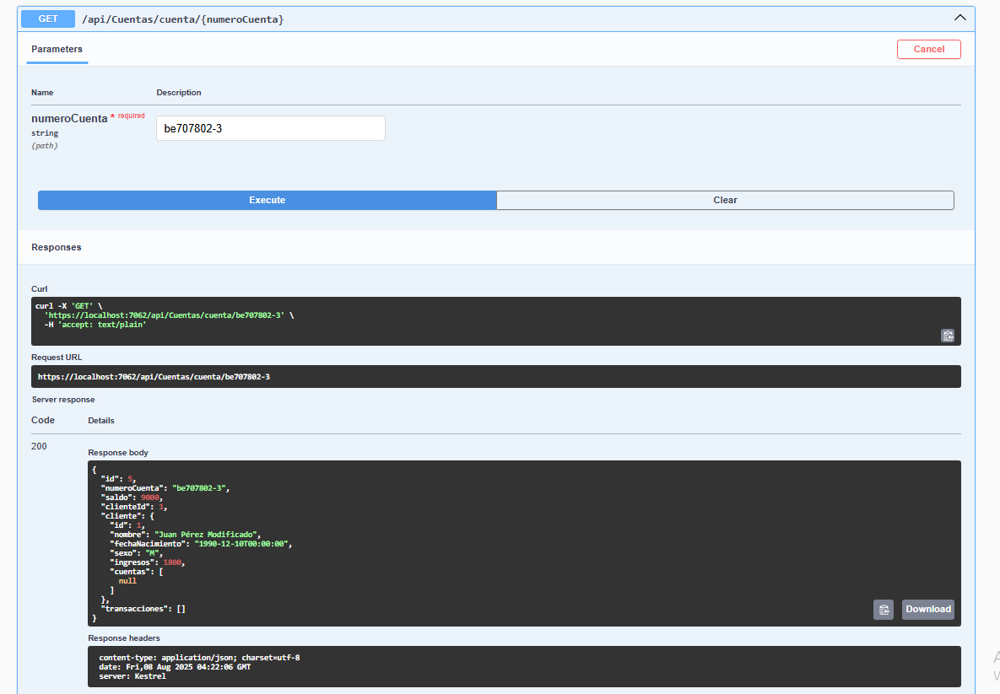


GET /api/cuentas/cliente/{clienteId} → Listar cuentas de un cliente


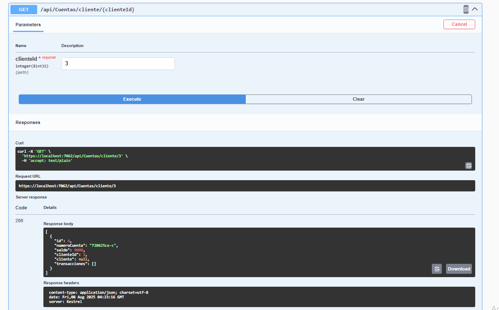


GET /api/cuentas/{numeroCuenta}/transacciones → Historial de transacciones


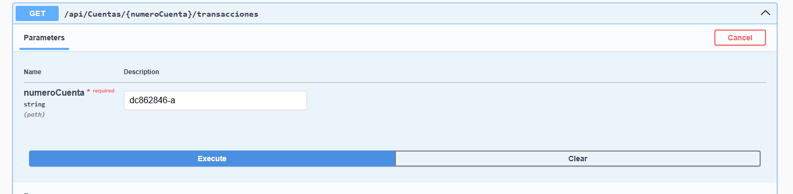

Respuesta


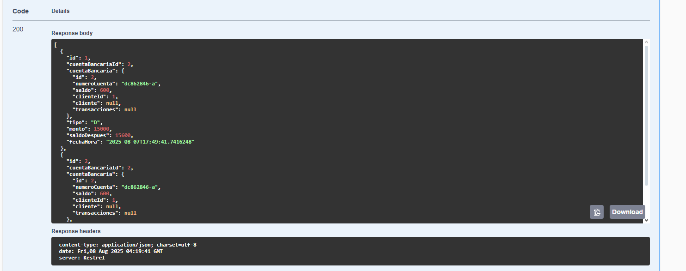

### Transacciones

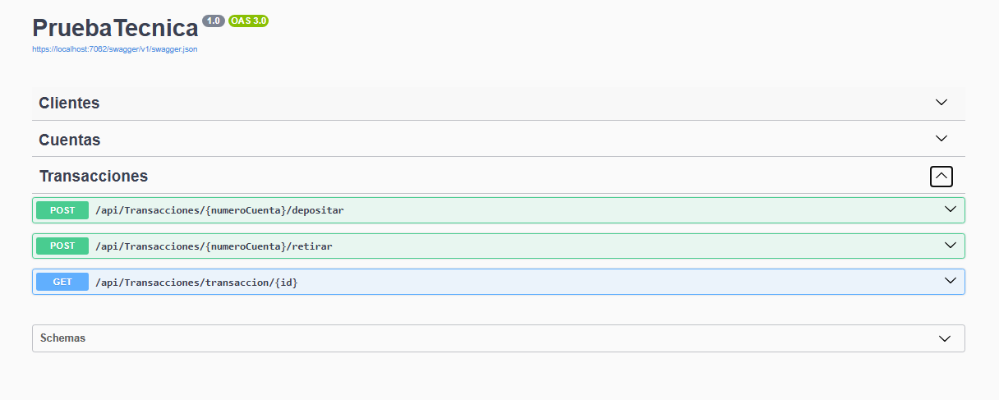

POST /api/transacciones/{numeroCuenta}/depositar?monto=100 → Depósito

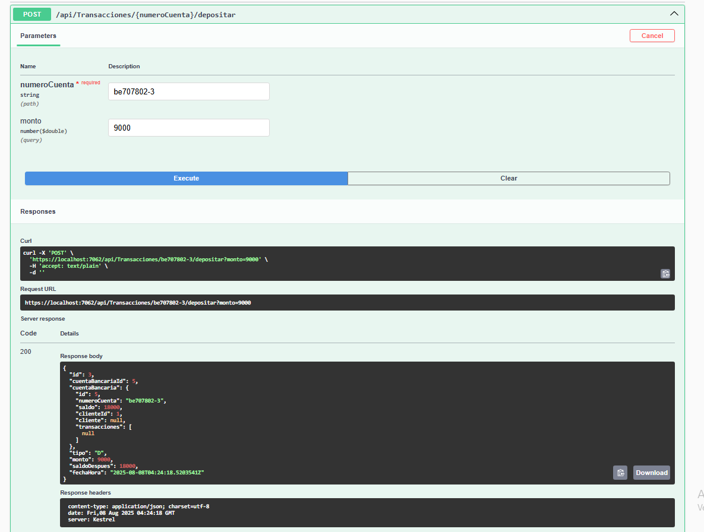


POST /api/transacciones/{numeroCuenta}/retirar?monto=50 → Retiro

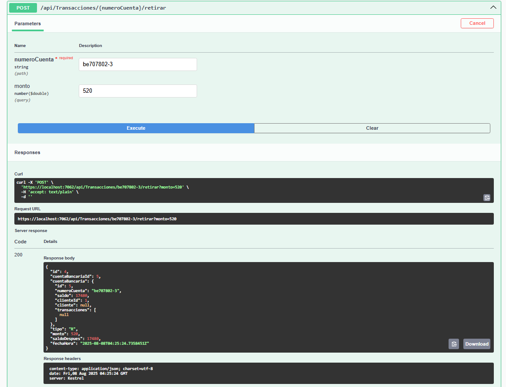

GET /api/transacciones/transaccion/{id} → Obtener transacción por ID

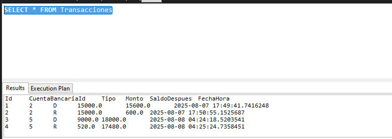

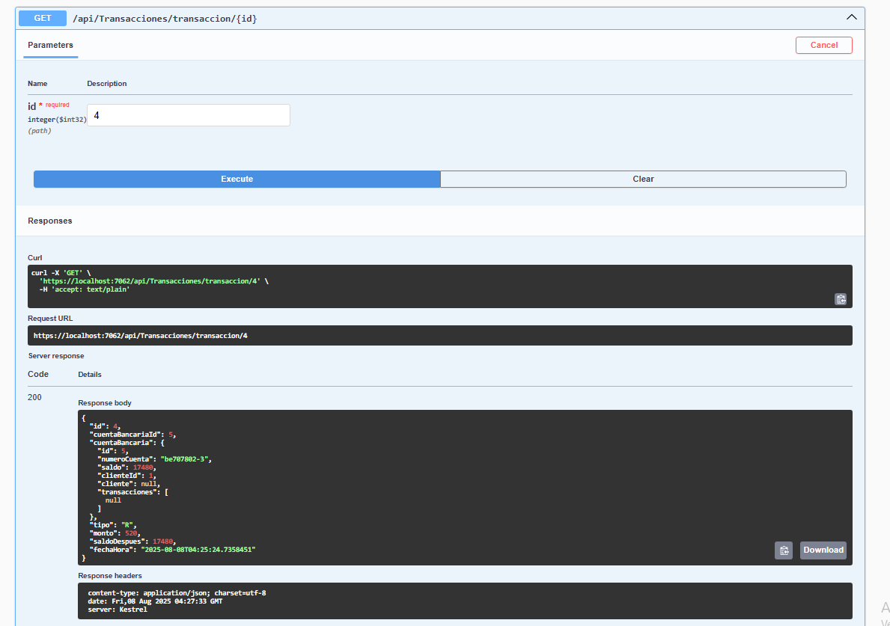

## Estructura del Proyecto 
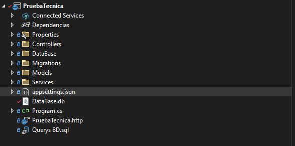

PruebaTecnica/

    Controllers/         # Controladores de API
    DataBase/               # DbContext y configuración EF
    Models/             # Entidades del dominio
    Services/           # Interfaces e implementación de lógica de negocio
    Program.cs           # Configuración principal de la aplicación

## Autor:
Alejandro Castillo 2025
